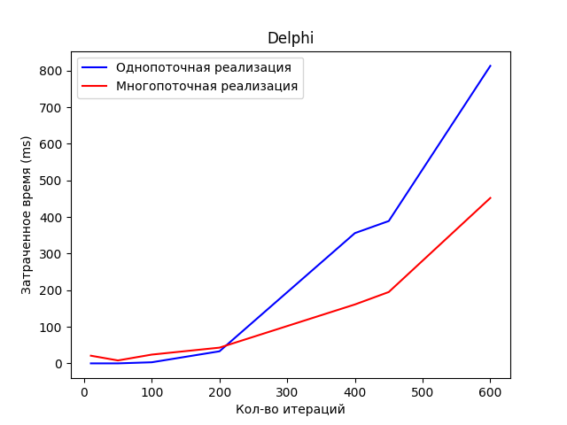

# Pyhton-threads

Использование потоков в python, тест производительности вычислений с потоками.  
Как видно из этого теста, из-за особенностей реализации потоков в Python, использование потоков практически не увеличивает производительность.

Аналогичный код(строчка в строчку) на Delphi показывает значительный прирост производительности при использовании потоков.

Delphi:  
```
mat size = (10, 10)
simple matrix multiply duration: 0ms
thread matrix multiply duration: 21ms

mat size = (50, 50)
simple matrix multiply duration: 0ms
thread matrix multiply duration: 8ms

mat size = (100, 100)
simple matrix multiply duration: 3ms
thread matrix multiply duration: 24ms

mat size = (200, 200)
simple matrix multiply duration: 33ms
thread matrix multiply duration: 43ms

mat size = (400, 400)
simple matrix multiply duration: 356ms
thread matrix multiply duration: 161ms
*** Thread-driven multuply is winner! ***

mat size = (450, 450)
simple matrix multiply duration: 389ms
thread matrix multiply duration: 195ms
*** Thread-driven multuply is winner! ***

mat size = (600, 600)
simple matrix multiply duration: 813ms
thread matrix multiply duration: 452ms
*** Thread-driven multuply is winner! ***

mat size = (800, 800)
simple matrix multiply duration: 2868ms
thread matrix multiply duration: 1322ms
*** Thread-driven multuply is winner! ***

mat size = (1500, 1500)
simple matrix multiply duration: 55258ms
thread matrix multiply duration: 29481ms
*** Thread-driven multuply is winner! ***
```

Pyhton:  
```
mat size = (10, 10)
 numpy matrix multiply duration: 0:00:00.000075
simple matrix multiply duration: 0:00:00.000250
thread matrix multiply duration: 0:00:00.001438

mat size = (50, 50)
 numpy matrix multiply duration: 0:00:00.000714
simple matrix multiply duration: 0:00:00.021228
thread matrix multiply duration: 0:00:00.028995

mat size = (100, 100)
 numpy matrix multiply duration: 0:00:00.003239
simple matrix multiply duration: 0:00:00.166963
thread matrix multiply duration: 0:00:00.181819

mat size = (200, 200)
 numpy matrix multiply duration: 0:00:00.015103
simple matrix multiply duration: 0:00:01.303002
thread matrix multiply duration: 0:00:01.366056

mat size = (400, 400)
 numpy matrix multiply duration: 0:00:00.097763
simple matrix multiply duration: 0:00:11.874073
thread matrix multiply duration: 0:00:12.092625

mat size = (450, 450)
 numpy matrix multiply duration: 0:00:00.141888
simple matrix multiply duration: 0:00:20.677068
thread matrix multiply duration: 0:00:19.869476
*** Thread-driven multuply is winner! ***

mat size = (600, 600)
 numpy matrix multiply duration: 0:00:00.292478
simple matrix multiply duration: 0:00:43.029158
thread matrix multiply duration: 0:01:02.638168
```

# Сравнительные графики:

